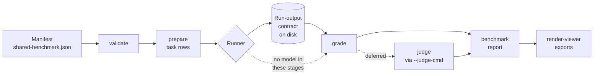
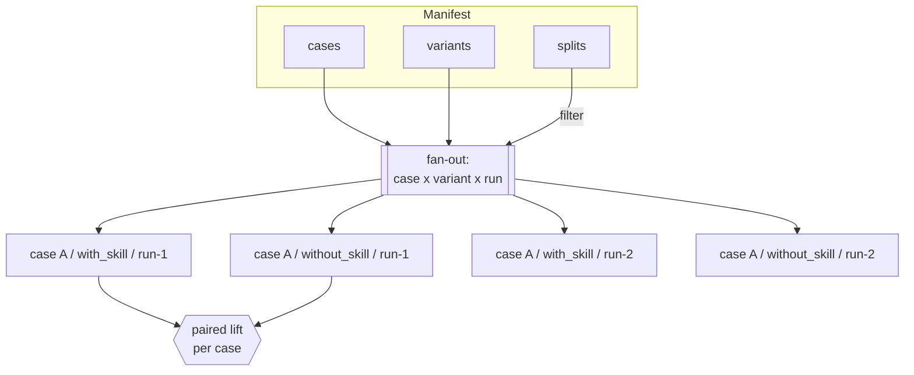
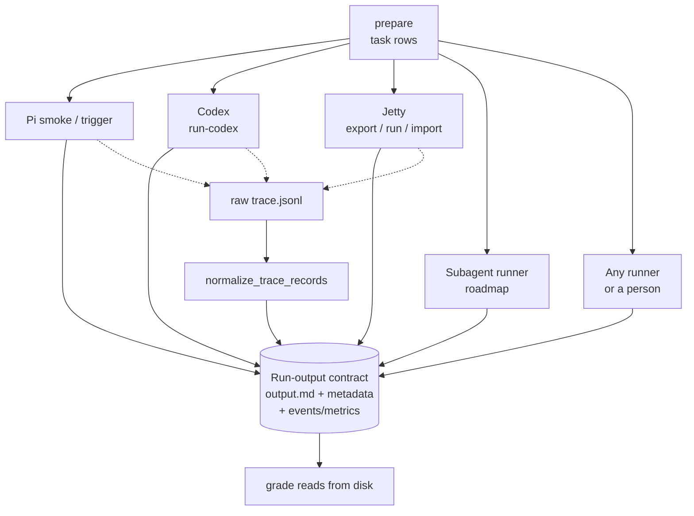
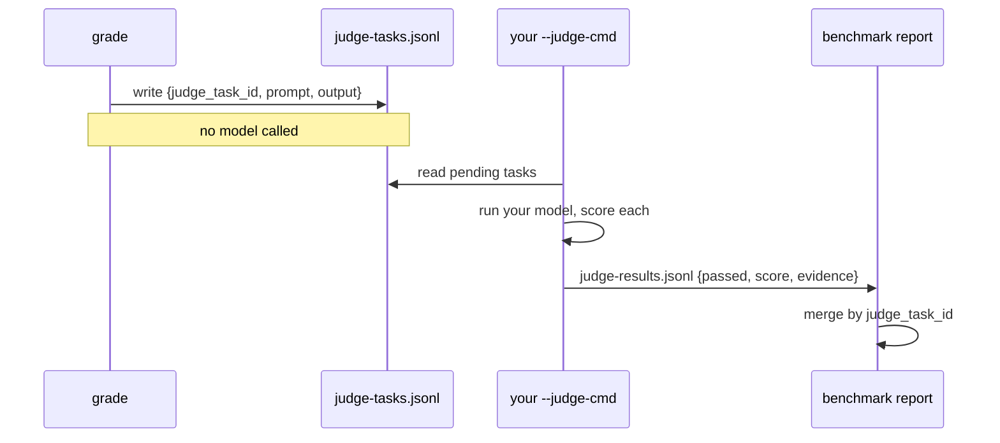

# Architecture

The harness scores whether a skill changes a model's output. It does this by running the
same case twice, once with the skill and once without, then grading both runs with checks
that call no model. Everything in the system follows from that one decision.

This doc shows how the pieces fit. For what each piece *is*, read
[`abstractions.md`](abstractions.md).

## The pipeline

A manifest flows left to right. Each stage consumes the previous stage's output and produces
the next stage's input. The runner is the only stage that talks to a model; grading and
reporting read files.

The dotted line marks the rule that shapes the rest of the design: from `grade` onward,
nothing calls a model. A judge runs only when you ask for it, through a command you supply,
and its results merge back at report time.

## Two axes, one grid

A case does not run once. It runs across a grid of variants and repeats, filtered by split.
`prepared_task_rows` builds this grid. The variant axis is where lift lives, because lift is
the difference between two arms of the same case.

Variants stay orthogonal to cases. A case knows nothing about which arm will run it, and an
arm applies to every case, so adding a `with_skill`/`without_skill` pair never edits case
text. The roadmap's model sweep adds a third axis (model) the same way: a new dimension in
the fan-out, not a new kind of variant.

## The runner boundary

Runners disagree about everything except one thing: they all leave the same files on disk.
That agreement is the contract, and it is why a new runner needs no change to grading.

Each runner emits its own event shape. `normalize_trace_records` collapses those shapes into
one schema-versioned `events.json` and `metrics.json` so a process assertion like
`command_order` reads the same fields no matter who produced the run. When the evidence is
missing, the assertion fails rather than guessing from the answer text.

## How a judge defers

A qualitative check cannot run at grade time, because the harness will not choose a model.
Instead grading records a task and moves on. You run the judge separately, then merge its
verdicts into the report.

The key is the `judge_task_id` (`case::variant::run-n::assertion`). It lets results arrive
out of band, from any model or human, and still land on the right assertion. Deterministic
checks run first; the judge handles only what a keyword or regex cannot.

## Where grading stays honest

Three properties hold across the whole pipeline, and the roadmap is written to preserve them:

- **Grading is local and deterministic.** `grade_case_variant` reads files and applies checks.
  No network, no model. A re-grade after editing an assertion costs nothing.
- **The harness picks no model.** Judge and runner models are yours to supply. The tool scores
  outputs; it does not decide who produces them.
- **Generation is answer-key-safe.** `prepare` omits expected behavior and rubrics unless you
  ask for them, so the model under test cannot read its own answer key.

A feature that needs a model (embedding similarity, generating harder cases) lives behind an
opt-in flag or an external command, the way `script` assertions already do. That placement is
not a detail; it is what keeps a passing benchmark trustworthy.
