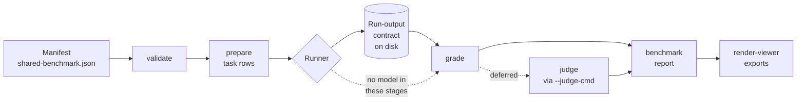
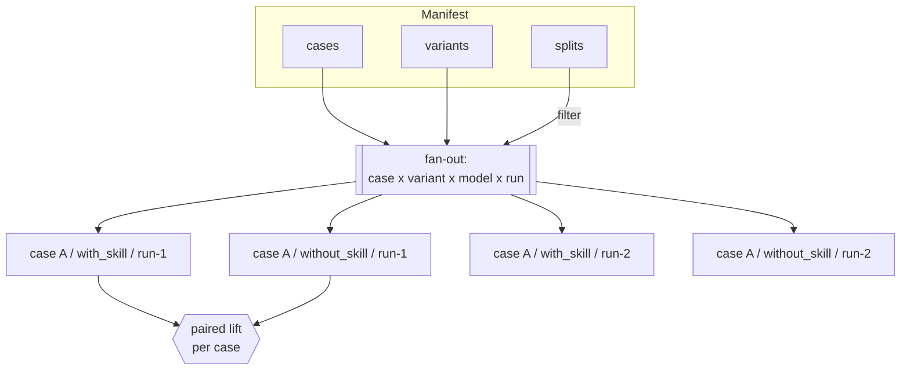
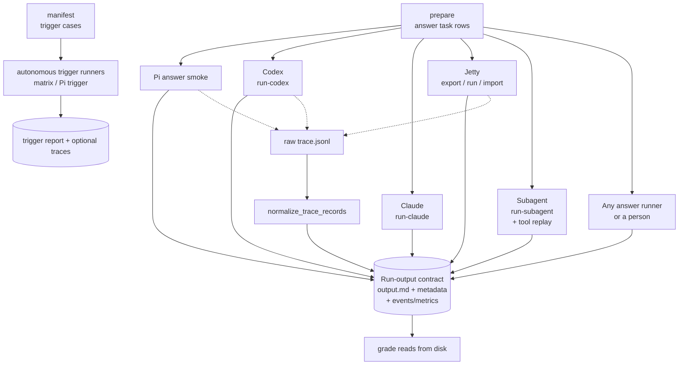
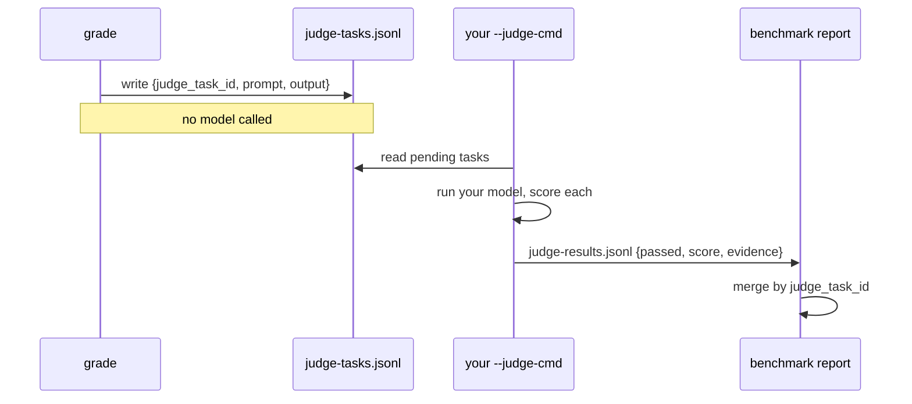

# Architecture

The harness scores whether a skill changes a model's output. It does this by running the
same case twice, once with the skill and once without, then grading both runs with checks
that call no model. Everything in the system follows from that one decision.

This doc shows how the pieces fit. For what each piece *is*, read
[`abstractions.md`](abstractions.md).

## The pipeline

A manifest flows left to right. Each stage consumes the previous stage's output and produces
the next stage's input. The runner is the only stage that talks to a model; grading and
reporting read files.



The dotted line marks the rule that shapes the rest of the design: the `grade`/`benchmark`
scoring path never calls a model. The one exception is the judge, which runs only when you
ask for it — through a `--judge-cmd` you supply, or natively via
`--judge-backend claude|codex|vibe` plus `--judge-model` — and whose results merge back at
report time, each stamped with the `judge_model`
that produced it.

## Four axes, one grid

A case does not run once. It runs across a grid of variants, models, and repeats, filtered by split.
`prepared_task_rows` builds this grid. The variant axis is where lift lives, because lift is
the difference between two arms of the same case.



Variants stay orthogonal to cases. A case knows nothing about which arm will run it, and an
arm applies to every case, so adding a `with_skill`/`without_skill` pair never edits case
text. The model sweep (`prepare --models a,b,c`) adds a third axis the same way: a new
dimension in the fan-out (`case × variant × model × run`), not a new kind of variant. The
report then groups `by_model` and computes lift per (case, model) — see `model_analysis`.

Before any lift, reliability, cost delta, or token-overhead value is computed, result rows become
`ExperimentalPairKey(case, model, repetition, population)` arms. Only a validated pair with exactly
one `with_skill` and one `without_skill` arm can contribute. Missing/ineligible arms remain blocked
diagnostics, and duplicate identities fail instead of overwriting an earlier row. Telemetry then
adds its stricter provenance/unit/billing-basis comparison.

## Typed trust boundaries

The on-disk formats stay JSON for interoperability, but JSON dictionaries do not flow freely through
the interior. Each external boundary has one parser and a closed value:

```text
prepared row -> PreparedTaskDraft -> PreparedTask
provider result -> Completed | TimedOut | SpawnFailed | ProviderFailed
judge row -> Boolean | Scored | Dimension | Dynamic | Consensus verdict
trace status -> Completed | InProgress | Failed | Unknown
Jetty status -> Queued | Running | Succeeded | Failed | TimedOut | ProtocolInvalid
result arms -> ExperimentalPair | BlockedExperimentalPair
```

Booleans such as execution success, verdict pass, Jetty success, and comparability are derived from
those variants. When a persisted row is read back, its parser re-establishes the invariant rather
than trusting fields that happened to serialize together. The detailed inventory and residual risks
are in [`correctness-by-construction-audit.md`](correctness-by-construction-audit.md).

## The runner boundary

Runners disagree about everything except one thing: they all leave the same files on disk.
That agreement is the contract, and it is why a new runner needs no change to grading.



Each runner emits its own event shape. `normalize_trace_records` collapses those shapes into
one schema-versioned `events.json` and `metrics.json` so a process assertion like
`command_order` reads the same fields no matter who produced the run. Lifecycle status is parsed
into a closed event state first; only completed operations count as commands, tools, reads, writes,
or skill invocation. When the evidence is missing or unknown, the assertion fails rather than
guessing from the answer text.

## How a judge defers

A qualitative check does not run inside `grade` itself: grading records a judge task and
moves on. You run the judge separately — with a `--judge-cmd` you supply, or
`--judge-backend claude|codex|vibe` plus `--judge-model` — then merge its verdicts (each
carrying its `judge_model`) into
the report.



The key is the `judge_task_id` (`case::variant::run-n::assertion`, gaining a `model` segment on
a multi-model run so verdicts cannot collide across models). It lets results arrive out of
band, from any model or human, and still land on the right assertion. Stored verdicts are parsed
into strict boolean/scored/dimension/dynamic/consensus variants; duplicate IDs and contradictory
score/threshold/pass fields are rejected. Deterministic checks run first; the judge handles only
what a keyword or regex cannot.

## Where grading stays honest

Three properties hold across the whole pipeline, and every feature — the roadmap included — is
built to preserve them:

- **Grading is local and deterministic.** `grade_case_variant` reads files and applies checks.
  No network, no model. A re-grade after editing an assertion costs nothing. A test guard
  (`test_confidence_floor.py`) patches `subprocess`/`urllib` to raise and proves the grade path
  completes without either.
- **The harness picks no model.** Judge and runner models are yours to supply. The tool scores
  outputs; it does not decide who produces them.
- **Generation is answer-key-safe.** `prepare` omits expected behavior and rubrics unless you
  ask for them, so the model under test cannot read its own answer key.

Each assertion carries a **severity** (`critical`/`gate`/`soft`), so pass/fail is not flat: a
`critical` failure vetoes the run and is excluded from every mean, a `gate` carries the pass
rate, and a `soft` result feeds only the per-run graded score — never a pass rate. That split
is threaded through every report view, which is what lets graded scores measure *how much
better* without a soft miss quietly moving the headline number.

Runs also carry **cost telemetry** on the same file contract: each `metadata.json`/`metrics.json`
holds normalized `usage_normalized`/`cost_normalized` blocks (missing is marked, never zero),
and the benchmark report aggregates them into a `cost_summary` ledger — operational spend kept
beside the quality signal, never mixed into it. `suite-run` projects that spend before any
model call and can gate on a budget.

A feature that needs a model (embedding similarity, generating harder cases) lives behind an
opt-in flag or an external command, the way `script` assertions already do. That placement is
not a detail; it is what keeps a passing benchmark trustworthy.
